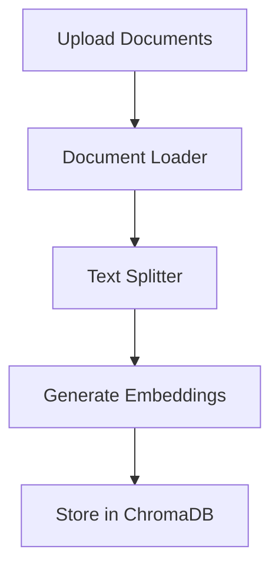
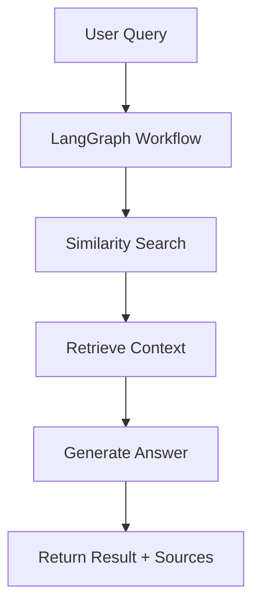

# 🤖 Complete RAG Pipeline with LangGraph, Gemini & ChromaDB

A comprehensive Retrieval Augmented Generation (RAG) pipeline built with LangGraph, Google's Gemini AI, and ChromaDB. Features a clean black and white Streamlit interface supporting multiple document types.

## 🌟 Features

- **LangGraph Orchestration**: State-based workflow management
- **Gemini AI Integration**: Powered by Google's Gemini 1.5 Flash
- **ChromaDB Vector Storage**: Persistent vector database
- **Multi-format Support**: PDF, DOCX, PPTX, TXT files
- **Web Scraping**: Direct URL content ingestion
- **Folder Processing**: Batch document processing
- **Clean UI**: Black and white Streamlit interface
- **Real-time Stats**: Vector store monitoring
- **Source Tracking**: Document provenance tracking

## Quick Start

## Screenshot


### 1. Install Dependencies

```bash
# Option 1: Install all at once
pip install langchain-text-splitters langchain-community langgraph langchain-core langchain langchain-google-genai google-generativeai chromadb langchain-chroma python-pptx python-docx PyPDF2 pdfplumber beautifulsoup4 requests streamlit streamlit-extras typing-extensions unstructured nltk

# Option 2: Use requirements.txt (create the file first)
pip install -r requirements.txt
```

### 2. Set Up Environment

```bash
# Set your Google API Key
export GOOGLE_API_KEY="your_google_api_key_here"
```

### 3. Run the Application

```bash
# Start the Streamlit app
streamlit run rag_pipeline.py

# Or use the run script
python run.py
```

## 📋 Required pip Modules

### Core LangChain Dependencies
- `langchain-text-splitters` - Document text splitting
- `langchain-community` - Community integrations  
- `langgraph` - Graph-based workflow orchestration
- `langchain-core` - Core LangChain functionality
- `langchain` - Main LangChain package

### AI Model Integration
- `langchain-google-genai` - Google Gemini integration
- `google-generativeai` - Google AI client library

### Vector Database
- `chromadb` - ChromaDB vector database
- `langchain-chroma` - LangChain ChromaDB integration

### Document Processing
- `python-pptx` - PowerPoint file processing
- `python-docx` - Word document processing
- `PyPDF2` - PDF file processing
- `pdfplumber` - Enhanced PDF parsing
- `beautifulsoup4` - Web content parsing
- `requests` - HTTP requests for web scraping

### User Interface
- `streamlit` - Web app framework
- `streamlit-extras` - Additional Streamlit components

### Utilities
- `typing-extensions` - Enhanced type annotations
- `unstructured` - Advanced document parsing (optional)
- `nltk` - Natural language processing (optional)

## 🏗️ Architecture

```
┌─────────────────┐    ┌──────────────────┐    ┌─────────────────┐
│   Documents     │────│  Text Splitter   │────│   ChromaDB      │
│ (PDF/DOCX/etc.) │    │   (Chunking)     │    │ (Vector Store)  │
└─────────────────┘    └──────────────────┘    └─────────────────┘
                                                         │
┌─────────────────┐    ┌──────────────────┐    ┌─────────────────┐
│   User Query    │────│   LangGraph      │────│   Retrieval     │
│                 │    │   Workflow       │    │                 │
└─────────────────┘    └──────────────────┘    └─────────────────┘
                                │                         │
                       ┌──────────────────┐              │
                       │  Gemini AI LLM   │◄─────────────┘
                       │   (Generation)   │
                       └──────────────────┘
                                │
                       ┌──────────────────┐
                       │   Final Answer   │
                       │  + Sources       │
                       └──────────────────┘
```

## 🔧 Usage Guide

### Document Upload
1. **File Upload**: Drag and drop or select multiple files (PDF, DOCX, PPTX, TXT)
2. **Web URL**: Enter any web URL to scrape content
3. **Multiple Files**: Upload entire folders of documents at once
4. **Process**: Click "Process Documents" to index all content

### Querying
1. **Ask Questions**: Enter natural language questions about your documents
2. **Get Answers**: Receive AI-generated responses with source citations
3. **View Context**: See the retrieved document chunks that informed the answer
4. **Track Sources**: Monitor which documents contributed to each answer

### Supported Document Types

| Type | Extension | Features |
|------|-----------|----------|
| PDF | `.pdf` | Text extraction, metadata preservation |
| Word | `.docx` | Full document content, formatting aware |
| PowerPoint | `.pptx` | Slide-by-slide extraction, speaker notes |
| Text | `.txt` | Plain text processing |
| Web | URLs | Content scraping, HTML parsing |

## 🔬 Technical Details

### LangGraph Workflow
The pipeline uses LangGraph to orchestrate the RAG process:

```python
# State Definition
class RAGState(TypedDict):
    question: str      # User query
    context: List[Document]  # Retrieved documents
    answer: str        # Generated response
    sources: List[str] # Source tracking

# Workflow Steps
1. retrieve(state) -> similarity_search()
2. generate(state) -> llm.invoke()
```

### Document Processing Pipeline

1. **Load**: Documents loaded using appropriate loaders
2. **Split**: Text split into chunks (1000 chars, 200 overlap)
3. **Embed**: Chunks embedded using Gemini embeddings
4. **Store**: Embeddings stored in ChromaDB
5. **Index**: Vector index built for similarity search

### Vector Store Configuration

```python
# ChromaDB Settings
persist_directory = "./chroma_db"
embedding_model = "models/embedding-001"
chunk_size = 1000
chunk_overlap = 200
similarity_top_k = 4
```

## Monitoring & Analytics

### Vector Store Stats
- Document count tracking
- Collection information
- Storage usage monitoring

### Query Analytics
- Recent query history
- Response time tracking
- Source utilization metrics

## 🛠️ Configuration Options

### Environment Variables
```bash
# Required
GOOGLE_API_KEY=your_api_key_here

# Optional
CHROMA_PERSIST_DIRECTORY=./chroma_db
CHUNK_SIZE=1000
CHUNK_OVERLAP=200
SIMILARITY_TOP_K=4
```

### Model Settings
- **LLM**: Gemini 1.5 Flash
- **Embeddings**: models/embedding-001
- **Temperature**: 0.3 (configurable)
- **Max Tokens**: Default Gemini limits

## 🎨 UI Features

### Clean Black & White Design
- Minimalist interface
- High contrast for readability
- Responsive layout
- Professional appearance

### Interactive Components
- File drag-and-drop upload
- Real-time processing feedback
- Expandable result sections
- Query history tracking

### Information Display
- Document previews
- Processing statistics
- Source citations
- Context visualization

## 🔍 Advanced Features

### Query Analysis
- Automatic query optimization
- Context-aware retrieval
- Multi-step reasoning support

### Document Metadata
- Source tracking
- File type identification
- Processing timestamps
- Custom metadata support

### Error Handling
- Robust file processing
- Network error recovery
- User-friendly error messages
- Graceful degradation

## 🚦 Getting Started Examples

### Example 1: Basic Document Q&A
```python
# Upload a PDF document
# Ask: "What is the main topic of this document?"
# Get: AI-generated summary with source citations
```

### Example 2: Multi-Document Analysis
```python
# Upload multiple research papers
# Ask: "Compare the methodologies across these studies"
# Get: Comparative analysis with document sources
```

### Example 3: Web Content Analysis
```python
# Enter URL: https://example.com/article
# Ask: "What are the key points mentioned in this article?"
# Get: Extracted insights with web source
```

## 🐛 Troubleshooting

### Common Issues

#### API Key Problems
```bash
# Error: Invalid API key
# Solution: Verify GOOGLE_API_KEY is correctly set
export GOOGLE_API_KEY="your_valid_key"
```

#### Document Processing Failures
```bash
# Error: Failed to load document
# Solution: Check file format and corruption
# Supported: PDF, DOCX, PPTX, TXT only
```

#### ChromaDB Connection Issues
```bash
# Error: Cannot connect to ChromaDB
# Solution: Check persistence directory permissions
mkdir -p ./chroma_db
chmod 755 ./chroma_db
```

### Performance Optimization

#### Large Document Handling
- Reduce chunk size for memory efficiency
- Increase chunk overlap for better context
- Use selective document processing

#### Query Optimization
- Use specific, focused questions
- Include relevant keywords
- Avoid overly broad queries

## 📚 Code Structure

```
rag_pipeline.py          # Main application file
├── DocumentProcessor    # Document loading and processing
├── RAGPipeline         # Core RAG logic with LangGraph
├── Streamlit UI        # Web interface components
└── Configuration       # Settings and constants

config.py               # Configuration management
startup.py              # Installation and setup
run.py                  # Simple run script
requirements.txt        # Python dependencies
README.md              # This documentation
```

## 🔄 Workflow Details

### 1. Document Indexing Phase


### 2. Query Processing Phase


## 🌐 Deployment Options

### Local Development
```bash
streamlit run rag_pipeline.py --server.port 8501
```

### Docker Deployment
```dockerfile
FROM python:3.11-slim
COPY . /app
WORKDIR /app
RUN pip install -r requirements.txt
EXPOSE 8501
CMD ["streamlit", "run", "rag_pipeline.py"]
```

### Cloud Deployment
- **Streamlit Cloud**: Direct GitHub integration
- **Google Cloud Run**: Containerized deployment  
- **AWS ECS**: Scalable container service
- **Heroku**: Simple PaaS deployment

## 📈 Performance Metrics

### Expected Performance
- **Document Processing**: ~1-2 seconds per MB
- **Query Response**: ~2-5 seconds per query
- **Concurrent Users**: 10-50 (depending on hardware)
- **Memory Usage**: ~2-4GB for typical workloads

### Scalability Considerations
- ChromaDB handles millions of vectors
- Gemini API has rate limits
- Streamlit memory usage grows with documents

- Consider Redis for session management
